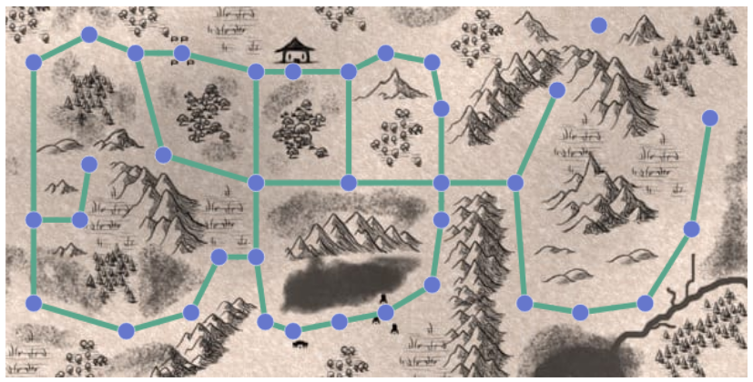
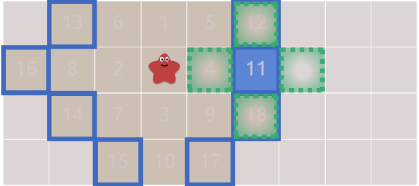
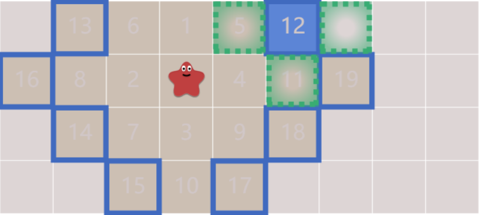

 ---
 title: 关于BFS、Astar、Dijkstra的个人理解
 date: 2024-10-15 12:00:00 +0800
 categories: [Blog, Build]
 tags: [blog]
 ---

[原文](https://www.redblobgames.com/pathfinding/a-star/introduction.html)
#### 图搜索算法
##### &emsp;&emsp;本文将从图搜索算法的基本流程入手，层层递进地介绍几种图搜索算法。先从广度优先搜索(BFS)入手，接着再在此基础上去探讨Dijkstar和A*算法。
##### BFS:从各个方向上去对图进行搜索。
##### Dijkstar:引入了代价，在搜索的时候将会按照代价的等高线进行探索
##### A*:一种启发式搜索算法，其具体形式取决于启发函数，一般为欧氏距离或为曼哈顿距离。
#### 表示地图
##### &emsp;&emsp;研究搜索算法的时候我们应该先理解数据是什么，在路径规划中，输入是图，而输出是从起始位置到目标位置的一组路径。

##### 如图，这就是一个输入，一个图表，图表由节点和边组成，规划算法中只会告诉从一个节点到另一个节点的路径是什么，他不会知道怎么过去，怎么过去是由控制器决定的。

##### &emsp;&emsp;这两个图没有什么不同，可能在不同的地方，不同的比例，每个节点到每个节点的距离不一样，但抽象化为图后，他们所指向的是一个图，因为图只有节点和边两个属性，节点相同，边相同的图便为同一张图。
#### BFS
##### &emsp;&emsp;图搜索算法的根本思想是追踪一个$frontier$的队列，该队列包含其中的节点信息。
##### 接下来我们循环进行以下操作直至$frontier$对列为空
##### <figure>(1)从边界中取出一个节点并删除它
##### <figure>(2)查找它的相邻节点，将$frontier$与$reached$(一个存储我们查找过的所有节点的集合)中没有的节点添加到$frontier$与$reached$中。
##### 如下图


##### 以下是BFS的核心代码(python)
```python
frontier = Queue()#创建一个队列
frontier.put(start)#将start(上图中的星星)放入队列
reached = set()#创建一个集合
reached.add(start)#将start放入集合
while not frontier.empty():#循环直至frontier为空
   current = frontier.get()#从frontier取出一个元素命其为current
   for next in graph.neighbors(current):#选定一个current相邻的元素为next
      if next not in reached:#如果next不足reached里边把next加入到frontier与reached里
         frontier.put(next)
         reached.add(next)
```
