 ---
 title: 关于Dijkstra算法及其代码详细解读
 date: 2024-10-15 12:00:00 +0800
 categories: [Blog, Build]
 tags: [blog]
 ---

#### 1. Dijkstra算法简介
##### 背景
###### &emsp;&emsp;迪杰斯特拉算法(Dijkstra)是由荷兰计算机科学家狄杰斯特拉于1959 年提出的，因此又叫狄克斯特拉算法。
##### 用途
###### &emsp;&emsp;该算法可以算出从一个顶点到其余各顶点的最短路径，解决的是有权图中最短路径问题。
##### 复杂度
###### &emsp;&emsp;该算法复杂度=$n²$
##### 核心思想
###### &emsp;&emsp;迪杰斯特拉算法主要特点是从起始点开始，采用贪心算法的策略，每次遍历到始点距离最近且未访问过的顶点的邻接节点，直到扩展到终点为止。
##### Dijkstra算法理解
###### &emsp;&emsp;Dijkstra算法是一种标号法：给赋权图的每一个顶点记一个数，称为顶点的标号：临时标号T 表示从始顶点到该标点的最短路长的上界、固定标号P 表示从始顶点到该顶点的最短路长。
#### 2. 算法示例
###### &emsp;&emsp;球初始点0到目标点6的最短路径

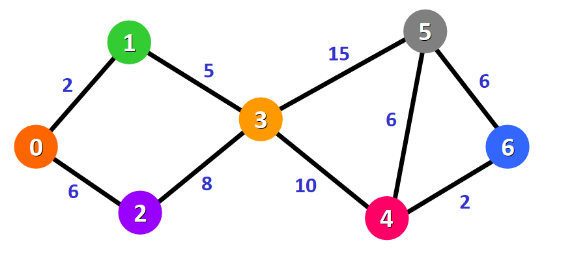

###### &emsp;&emsp;首先令0点到除了0点的所有点的距离为无穷，0→0本身的距离为0 

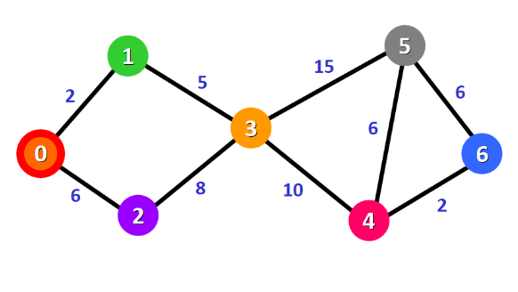

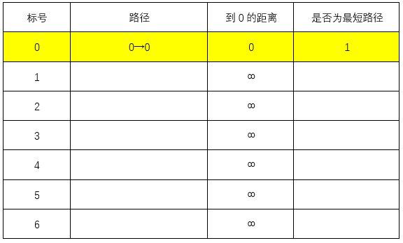

###### &emsp;&emsp;接下来搜索与0相关的节点，1、2，0→1的距离为2<∞，0→2的距离为6<∞，更新图表

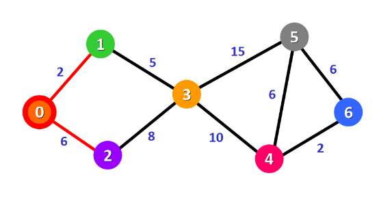

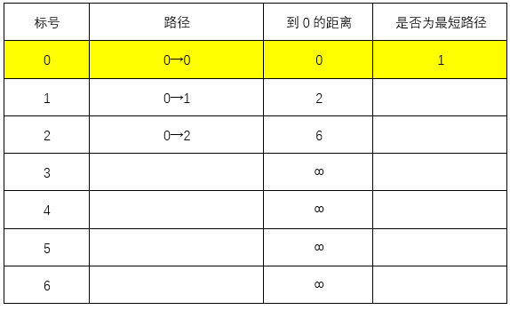

###### &emsp;&emsp;除自身外最近的节点为1，可知最短路径0→1，最短距离为2

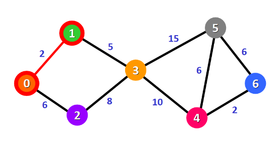

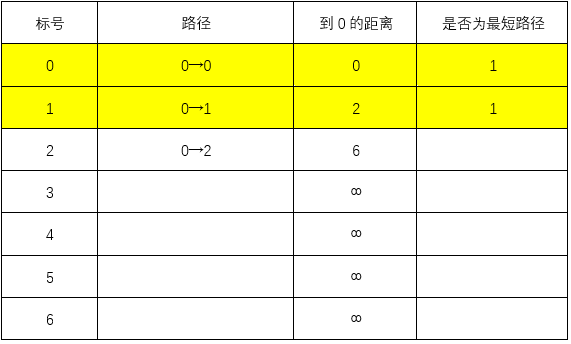

###### &emsp;&emsp;上一步找到了最短路径0→1，则：
###### &emsp;&emsp;0→1→3的距离为7<∞，更新表格

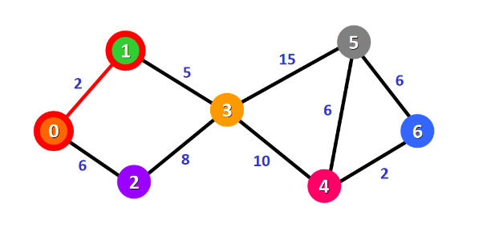

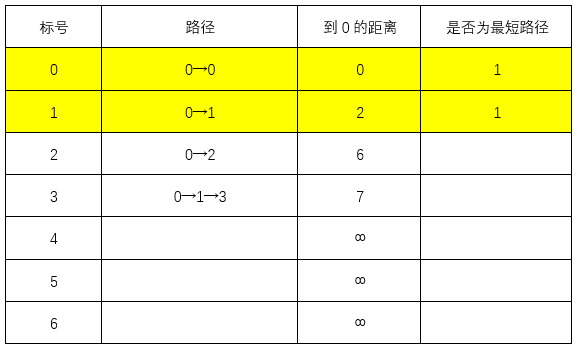

###### &emsp;&emsp;此时最短路径0→2，最短距离为6

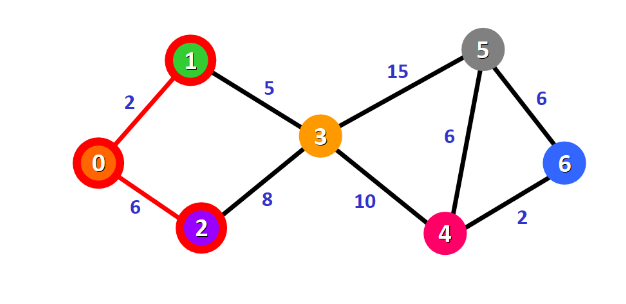

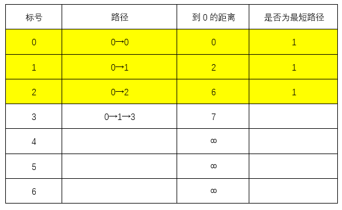

###### &emsp;&emsp;上一步最短路径为0→2，最短距离为6，则：
###### &emsp;&emsp;0→2→3的距离为15>7：不更新表格

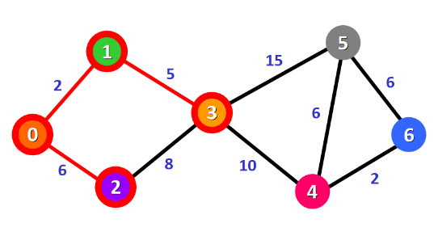

###### &emsp;&emsp;此时最短路径0→1→3，最短距离为7

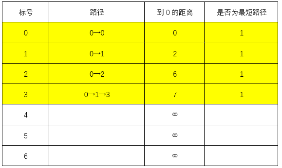

###### &emsp;&emsp;上一步最短路径为0→1→3，则：
###### &emsp;&emsp;0→1→3→5的距离为22<∞：更新表格
###### &emsp;&emsp;0→1→3→4的距离为17<∞：更新表格

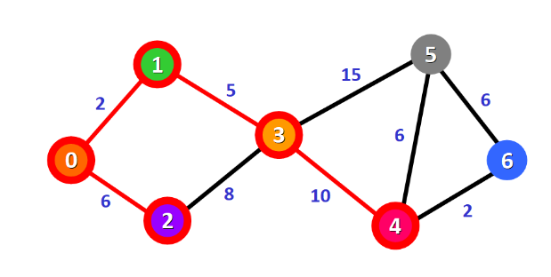

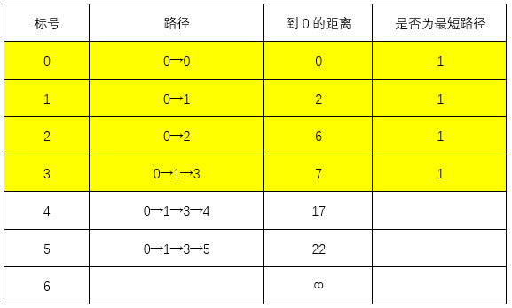

###### &emsp;&emsp;此时最短路径0→1→3→4，最短距离为17

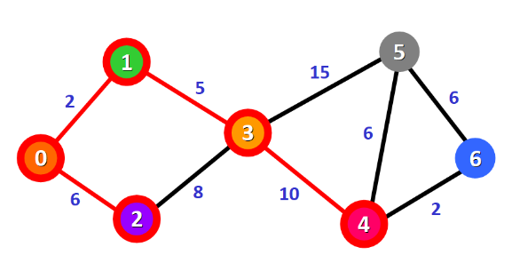

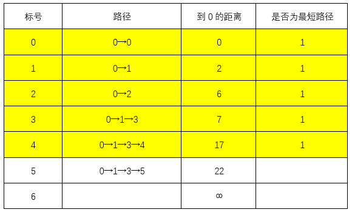

###### &emsp;&emsp;上一步最短路径0→1→3→4，最短距离为17，则：
###### &emsp;&emsp;0→1→3→4→5的距离为23>22：不更新表格
###### &emsp;&emsp;0→1→3→4→6的距离为19<∞：更新表格

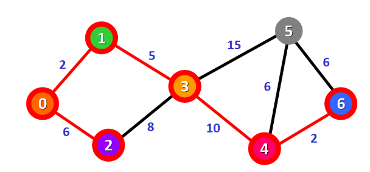

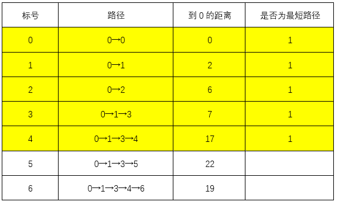

###### &emsp;&emsp;此时最短路径0→1→3→4→6，最短距离为19

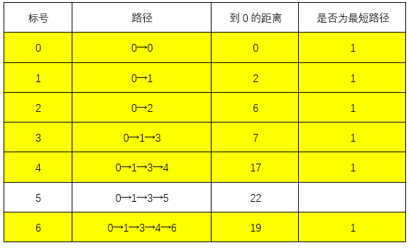

###### &emsp;&emsp;此时目标点已经成为最短路径，则结束上述循环，最短路径为0→1→3→4→6，最短距离为19。

