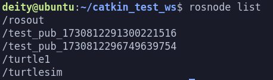
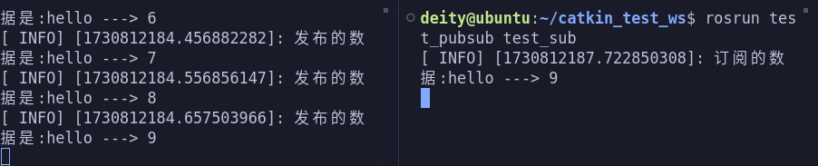

## ROS常用API

### 一、初始化

```cpp
void init(int &argc, char **argv, const std::string& name, uint32_t options = 0);
```

1. 作用：
    初始化ROS节点
2. 参数
__1. argc__:--------封装实参的个数,有 __n+1__ 个
__2. argv__:--------封装实参的数组
__3. name__:--------节点名称
__4. options__:-----节点启动选项
3. 作用
__1. argc__ 与 __argv__ 
为节点程序传入参数的两个参数，__argv[1]~argv[n]__ 为传进去的参数，__argv[0]__ 为节点名称。
__2. options__
解决需要不止一次开启这个节点的时候的一个参数，因为 __ROS_Master__ 的节点唯一性，重复启动同一个节点程序的时候，会导致第一次启动的节点程序被关闭，此时对 __options__ 进行以下配置便会对启动的节点名称后面加一个随机数，便可以重复启动同一个节点程序。
```cpp
ros::init_options::AnonymousName
```

以下是一个示例代码及其结果演示
```cpp
#include"ros/ros.h"
#include"std_msgs/String.h"
#include<sstream>
/*
    发布实现：
        1.包含头文件
            ROS下的文本类型 ---> std_msgs/String.h
        2.初始ros节点
        3.创建节点句柄
        4.创建发布对象
        5.编写发布逻辑并发布数据
*/
int main(int argc, char *argv[])
{
    //设置编码
    setlocale(LC_ALL,"");
    // 2.初始化ros节点
    ros::init(argc,argv,"test_pub",ros::init_options::AnonymousName);
    // 3.创建节点句柄
    ros::NodeHandle nh;
    // 4.创建发布对象
    ros::Publisher pub = nh.advertise<std_msgs::String>("fang",10,true);
    // 5.编写发布逻辑并发布数据
    //先创建被发布的消息
    std_msgs::String msg;
    //发布频率
    ros::Rate rate(10);
    //设置编号
    int count = 0;
    //编写循环,循环中发布数据
    while (ros::ok())
    {
        count++;
        //实现字符串拼接数据
        std::stringstream ss;
        ss<< "hello ---> " << count;
        msg.data = ss.str();
        if(count < 10)
        {
            pub.publish(msg);
            //添加日志
            ROS_INFO("发布的数据是:%s",ss.str().c_str());
        }
        rate.sleep();
    }
    
    return 0;
}
```
__结果演示__:

<p align = ""></p>

### 二、发布者对象

```cpp 
Publisher advertise(const std::string& topic, uint32_t queue_size, bool latch = false)
```

__作用__: 创建发布者对象
__模板__: 被发布的消息的类型
__参数__:
1. 话题名称
2. 队列长度
3. __latch__ (可选)如果设置为 __true__，会保存发布方的最后一条消息，并且新的订阅对象连接到发布方时，发布方会将这条消息发送给订阅者

__使用__:
__latch__ 设置为 __true__ 的作用:
以静态地图发布为例，方案1:可以使用固定频率发送地图数据，但是效率低，方案2；可以将地图发布对象的 __latch__ 设置为 __true__,并且发布方只发送一次教据,每当订阅者连接时，将地图数据发送给订间者(只发送一次)，这样提高了数据的发送效率。

__注：latch只会让订阅者接收最后一条消息__

以下是一个示例代码及其结果演示
```cpp
#include"ros/ros.h"
#include"std_msgs/String.h"
#include<sstream>
/*
    发布实现：
        1.包含头文件
            ROS下的文本类型 ---> std_msgs/String.h
        2.初始ros节点
        3.创建节点句柄
        4.创建发布对象
        5.编写发布逻辑并发布数据
*/
int main(int argc, char *argv[])
{
    //设置编码
    setlocale(LC_ALL,"");
    // 2.初始化ros节点
    ros::init(argc,argv,"test_pub",ros::init_options::AnonymousName);
    // 3.创建节点句柄
    ros::NodeHandle nh;
    // 4.创建发布对象
    ros::Publisher pub = nh.advertise<std_msgs::String>("fang",10,true);
    // 5.编写发布逻辑并发布数据
    //先创建被发布的消息
    std_msgs::String msg;
    //发布频率
    ros::Rate rate(10);
    //设置编号
    int count = 0;
    //编写循环,循环中发布数据
    while (ros::ok())
    {
        count++;
        //实现字符串拼接数据
        std::stringstream ss;
        ss<< "hello ---> " << count;
        msg.data = ss.str();
        if(count < 10)
        {
            pub.publish(msg);
            //添加日志
            ROS_INFO("发布的数据是:%s",ss.str().c_str());
        }
        rate.sleep();
    }
    
    return 0;
}
```
__结果演示__:

<p align = ""></p>
