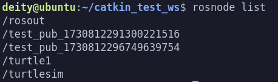
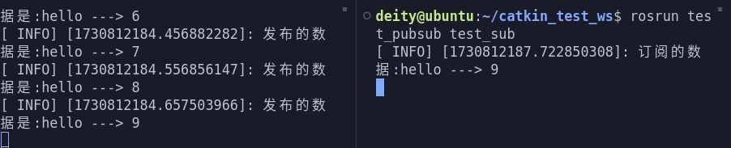
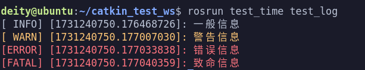

## ROS常用API与定时器

### 一、初始化

```cpp
void init(int &argc, char **argv, const std::string& name, uint32_t options = 0);
```

1. 作用：
    初始化ROS节点
2. 参数
__1. argc__:--------封装实参的个数,有 __n+1__ 个
__2. argv__:--------封装实参的数组
__3. name__:--------节点名称
__4. options__:-----节点启动选项
3. 作用
__1. argc__ 与 __argv__ 
为节点程序传入参数的两个参数，__argv[1]~argv[n]__ 为传进去的参数，__argv[0]__ 为节点名称。
__2. options__
解决需要不止一次开启这个节点的时候的一个参数，因为 __ROS_Master__ 的节点唯一性，重复启动同一个节点程序的时候，会导致第一次启动的节点程序被关闭，此时对 __options__ 进行以下配置便会对启动的节点名称后面加一个随机数，便可以重复启动同一个节点程序。
```cpp
ros::init_options::AnonymousName
```

以下是一个示例代码及其结果演示
```cpp
#include"ros/ros.h"
#include"std_msgs/String.h"
#include<sstream>
/*
    发布实现：
        1.包含头文件
            ROS下的文本类型 ---> std_msgs/String.h
        2.初始ros节点
        3.创建节点句柄
        4.创建发布对象
        5.编写发布逻辑并发布数据
*/
int main(int argc, char *argv[])
{
    //设置编码
    setlocale(LC_ALL,"");
    // 2.初始化ros节点
    ros::init(argc,argv,"test_pub",ros::init_options::AnonymousName);
    // 3.创建节点句柄
    ros::NodeHandle nh;
    // 4.创建发布对象
    ros::Publisher pub = nh.advertise<std_msgs::String>("fang",10,true);
    // 5.编写发布逻辑并发布数据
    //先创建被发布的消息
    std_msgs::String msg;
    //发布频率
    ros::Rate rate(10);
    //设置编号
    int count = 0;
    //编写循环,循环中发布数据
    while (ros::ok())
    {
        count++;
        //实现字符串拼接数据
        std::stringstream ss;
        ss<< "hello ---> " << count;
        msg.data = ss.str();
        if(count < 10)
        {
            pub.publish(msg);
            //添加日志
            ROS_INFO("发布的数据是:%s",ss.str().c_str());
        }
        rate.sleep();
    }
    
    return 0;
}
```
__结果演示__:

<p align = "">

### 二、发布者对象

```cpp 
Publisher advertise(const std::string& topic, uint32_t queue_size, bool latch = false)
```

__作用__: 创建发布者对象
__模板__: 被发布的消息的类型
__参数__:
1. 话题名称
2. 队列长度
3. __latch__ (可选)如果设置为 __true__，会保存发布方的最后一条消息，并且新的订阅对象连接到发布方时，发布方会将这条消息发送给订阅者

__使用__:
__latch__ 设置为 __true__ 的作用:
以静态地图发布为例，方案1:可以使用固定频率发送地图数据，但是效率低，方案2；可以将地图发布对象的 __latch__ 设置为 __true__,并且发布方只发送一次教据,每当订阅者连接时，将地图数据发送给订间者(只发送一次)，这样提高了数据的发送效率。

__注：latch只会让订阅者接收最后一条消息__

以下是一个示例代码及其结果演示

```cpp
#include"ros/ros.h"
#include"std_msgs/String.h"
#include<sstream>
/*
    发布实现：
        1.包含头文件
            ROS下的文本类型 ---> std_msgs/String.h
        2.初始ros节点
        3.创建节点句柄
        4.创建发布对象
        5.编写发布逻辑并发布数据
*/
int main(int argc, char *argv[])
{
    //设置编码
    setlocale(LC_ALL,"");
    // 2.初始化ros节点
    ros::init(argc,argv,"test_pub",ros::init_options::AnonymousName);
    // 3.创建节点句柄
    ros::NodeHandle nh;
    // 4.创建发布对象
    ros::Publisher pub = nh.advertise<std_msgs::String>("fang",10,true);
    // 5.编写发布逻辑并发布数据
    //先创建被发布的消息
    std_msgs::String msg;
    //发布频率
    ros::Rate rate(10);
    //设置编号
    int count = 0;
    //编写循环,循环中发布数据
    while (ros::ok())
    {
        count++;
        //实现字符串拼接数据
        std::stringstream ss;
        ss<< "hello ---> " << count;
        msg.data = ss.str();
        if(count < 10)
        {
            pub.publish(msg);
            //添加日志
            ROS_INFO("发布的数据是:%s",ss.str().c_str());
        }
        rate.sleep();
    }
    
    return 0;
}
```

__结果演示__:

<p align = "">


### 三、回调函数


#### 1.spinOnce()

```cpp
/**
 * \brief 处理一轮回调
 *
 * 一般应用场景:
 *     在循环体内，处理所有可用的回调函数
 * 
 */
ROSCPP_DECL void spinOnce();
```


#### 2.spin()

```cpp
/** 
 * \brief 进入循环处理回调 
 */
ROSCPP_DECL void spin();
```
#### 3.二者比较

相同点:二者都用于处理回调函数；

不同点:__ros::spin()__ 是进入了循环执行回调函数，而 __ros::spinOnce()__ 只会执行一次回调函数(没有循环)，在 __ros::spin()__ 后的语句不会执行到，而 __ros::spinOnce(__) 后的语句可以执行。

### 四、时间

__结果演示__：
<p align = "">

#### 1.时间

时间的类型分为 __Time__ 与 __Duration__ 两种分别为时刻与持续时间，对时间的操作也就是对这两种类型进行操作，下面会通过对两种类型进行操作来介绍有关函数。

__时刻__

该代码作用为：获取当前时间并以浮点数和整数显示

```cpp
    //1.初始化（头文件，节点初始化，句柄初始化）
    ros::init(argc, argv, "test_time");
    ros::NodeHandle nh;//句柄不初始化的话时间API会调用失败
    //2.获取当前时刻
    //now会返回当前时间的时间（被调用那一刻）
    //返回时间以1970年1月1日 00::00::00开始计时
    ros::Time right_now = ros::Time::now();
    //toSec()以浮点数s显示时间
    //sec是以整数s显示时间
    ROS_INFO("现在的时间为:%.2f", right_now.toSec());
    ROS_INFO("现在的时间为:%d", right_now.sec);
    //3.设置当前时刻
    //(s, ns)第一个是秒，第二个是纳秒，时间为两个加起来，依旧是以上面那个时间参考系
    ros::Time t1(20, 313113222);
    ros::Time t2(40.12);

    ROS_INFO("t1的时间为:%.2f", t1.toSec());
    ROS_INFO("t2的时间为:%.2f", t2.toSec());
```

该代码作用为：令系统休眠5s

__持续时间__

```cpp
    ros::Time start_time = ros::Time::now();
    
    ROS_INFO("开始休眠:%.2f", start_time.toSec());
    ros::Duration du(5);
    du.sleep();
    ros::Time end_time = ros::Time::now();

    ROS_INFO("结束休眠:%.2f", end_time.toSec());
```

__两者的相互运算__

该代码作用为：对持续时间与时刻两两进行了加减运算

```cpp
//时刻与持续时间运算
    //1.获取程序开始时刻
    ros::Time begin = ros::Time::now();
    //2.模拟运行
    ros::Duration du1(5);
    //3.计算时刻值
    ros::Time stop = begin + du1;
    // ros::Time stop = begin - du1;
    ROS_INFO("开始时刻:%.2f", begin.toSec());
    ROS_INFO("运行时间:%.2f", du1.toSec());
    ROS_INFO("程序运行时间：%.2f", stop.toSec());

    //时刻与时刻
    // ros::Time sum = begin + stop;//不可以相加
    ros::Duration du2 = begin - stop;//减可以，但类型会变成Duration
    ROS_INFO("时刻相减：%.2f", du2.toSec());

    //持续时间于持续时间
    ros::Duration du3 = du1 + du2;//0
    ros::Duration du4 = du1 - du2;//10
    ROS_INFO("持续时间相加：%.2f", du3.toSec());
    ROS_INFO("持续时间相减：%.2f", du4.toSec());
```

#### 2.定时器

定时器是一种 __ros__ 内置的一种计数器， __ros__ 内置了对定时器的操作

```cpp
    ROS_INFO("-----------------定时器-----------------");
    //ros::Timer createTimer(ros::Duration period, //定时器周期
    //const ros::TimerCallback &callback,          //回调函数
    //bool oneshot = false,                        //是否循环启动，false是循环启动
    //bool autostart = true) const                 //是否自动启动手动需要使用 timer.start(),另外要使用ros::spin()

    ros::Timer timer = nh.createTimer(ros::Duration(1), TIM1_Callback, false, false);
    timer.start();
    ros::spin();//不能忽略，一旦有回调函数便需要ros::spin()
```
#### 3.完整代码
```cpp
#include"ros/ros.h"

/*
    需求1：时间相关操作（获取当前时间以及设置指定时刻）
    实现：
        1.初始化（头文件，节点初始化，句柄初始化）
        2.获取当前时刻
        3.设置当前时刻
    
    需求2：程序中休眠5s
    实现：
        1.创建持续时间对象
        2.休眠
    需求3：已知程序开始运行的时刻，以及程序运行的时间，求结束的时刻
    实现：
        1.获取开始运行时刻
        2.模拟运行时间
        3.将其加和计算
    注意：
        1.时刻与持续时间之间可以相加减，结果类型为时刻
        2.持续时间与持续时间之间可以相加减，结果类型为持续时间
        3.时刻与时刻之间，只可相减不可相加，相减结果类型为持续时间
    需求4：每隔一秒钟，输出一次日志
    实现：
        1.ros::Rate();
        2.TIM(定时器)

*/
void TIM1_Callback(const ros::TimerEvent& event)
{
    ros::Time Timer_time = ros::Time::now();
    ROS_INFO("当前时间为:%.2f",Timer_time.toSec());
}
int main(int argc, char *argv[])
{
    //1.初始化（头文件，节点初始化，句柄初始化）
    setlocale(LC_ALL, "");
    ros::init(argc, argv, "test_time");
    ros::NodeHandle nh;//句柄不初始化的话时间API会调用失败
    //2.获取当前时刻
    //now会返回当前时间的时间（被调用那一刻）
    //返回时间以1970年1月1日 00::00::00开始计时
    ros::Time right_now = ros::Time::now();
    //toSec()以s显示时间
    ROS_INFO("现在的时间为:%.2f", right_now.toSec());
    ROS_INFO("现在的时间为:%d", right_now.sec);
    //3.设置当前时刻
    //(s, ns)第一个是秒，第二个是纳秒，时间为两个加起来，依旧是以上面那个时间参考系
    ros::Time t1(20, 313113222);
    ros::Time t2(40.12);

    ROS_INFO("t1的时间为:%.2f", t1.toSec());
    ROS_INFO("t2的时间为:%.2f", t2.toSec());
    //-----------------------------------------
    ROS_INFO("-----------------持续时间-----------------");
    ros::Time start_time = ros::Time::now();
    
    ROS_INFO("开始休眠:%.2f", start_time.toSec());
    ros::Duration du(5);
    du.sleep();
    ros::Time end_time = ros::Time::now();

    ROS_INFO("结束休眠:%.2f", end_time.toSec());
    //-----------------------------------------
    ROS_INFO("-----------------时间运算-----------------");
    //时刻与持续时间运算
    //1.获取程序开始时刻
    ros::Time begin = ros::Time::now();
    //2.模拟运行
    ros::Duration du1(5);
    //3.计算时刻值
    ros::Time stop = begin + du1;
    // ros::Time stop = begin - du1;
    ROS_INFO("开始时刻:%.2f", begin.toSec());
    ROS_INFO("运行时间:%.2f", du1.toSec());
    ROS_INFO("程序运行时间：%.2f", stop.toSec());

    //时刻与时刻
    // ros::Time sum = begin + stop;//不可以相加
    ros::Duration du2 = begin - stop;//减可以，但类型会变成Duration
    ROS_INFO("时刻相减：%.2f", du2.toSec());

    //持续时间于持续时间
    ros::Duration du3 = du1 + du2;//0
    ros::Duration du4 = du1 - du2;//10
    ROS_INFO("持续时间相加：%.2f", du3.toSec());
    ROS_INFO("持续时间相减：%.2f", du4.toSec());

    //-----------------------------------------
    ROS_INFO("-----------------定时器-----------------");
    //ros::Timer createTimer(ros::Duration period, //定时器周期
    //const ros::TimerCallback &callback,          //回调函数
    //bool oneshot = false,                        //是否循环启动，false是循环启动
    //bool autostart = true) const                 //是否自动启动手动需要使用 timer.start(),另外要使用ros::spin()

    ros::Timer timer = nh.createTimer(ros::Duration(1), TIM1_Callback, false, false);
    timer.start();
    ros::spin();    
    return 0;
}

```


### 五、日志
__ros__ 中内置了与日志有关的函数，可以帮助我们更好的调试代码或观测系统的运行状态
主要有以下几种
```cpp
    ROS_DEBUG("调试信息");//不会输出到控制台
    ROS_INFO("一般信息");//输出到控制台，为白色字段
    ROS_WARN("警告信息");//输出到控制台，为黄色字段
    ROS_ERROR("错误信息");//输出到控制台，为红色字段
    ROS_FATAL("致命信息");//输出到控制台，为红色字段
```

__结果演示__：

<p align = "">
