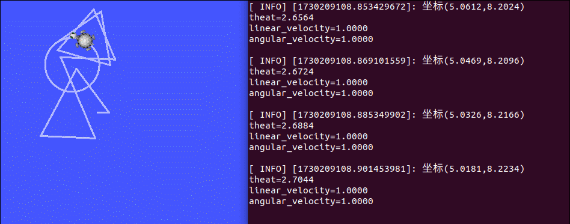

### 乌龟运动位姿检测
__需求描述__: 实时打印当前乌龟的位姿。

__结果演示__:
<p align = ""></p>


##### 实现分析:

首先，需要启动乌龟显示以及运动控制节点并控制乌龟运动。要通过ROS命令，来获取乌龟位姿发布的话题以及消息。编写订阅节点，订阅并打印乌龟的位姿。
##### 实现流程:

1. 通过ros命令获取话题与消息信息。
2. 编码实现位姿获取节点。
3. 启动 roscore、turtlesim_node 、控制节点以及位姿订阅节点，控制乌龟运动并输出乌龟的位姿。

#### 1.话题与消息获取

##### 获取话题: /turtle1/pose

```
rostopic list
```

##### 获取消息类型: turtlesim/Pose
```
rostopic type  /turtle1/pose
```
##### 获取消息格式:
```
rosmsg info turtlesim/Pose
```
##### 响应结果:
```
​float32 x
float32 y
float32 theta
float32 linear_velocity
float32 angular_velocity
```

#### 2.创建launch文件

##### 作用

对于节点众多的系统程序而已，__rosrun__ 每一个节点是不显示的，对于这种情况下，__ros__ 给出了 __launch__ 在该功能包下创建 __launch__ 文件夹，在其中创建 __username.launch__ 文件，以下面为例进行编写。
```xml
<launch>
    <node name="turtle1" pkg="turtlesim" type="turtlesim_node" output="screen"/>
    #name：用户的命名
    #pkg:节点所在功能包名称
    #type:节点名
    #output:输出到终端
    <node name="key" pkg="turtlesim" type="turtle_teleop_key" output="screen"/>
</launch>
```
该程序启动了两个节点，分别是 __turtlesim_node,turtle_teleop_key__ 。
使用```roslaunch userpkg userlaunch```启动launch文件，即可一键打开这些节点。

#### 2.实现订阅节点
创建功能包需要依赖的功能包: __roscpp rospy std_msgs turtlesim__
实例
```cpp
#include"ros/ros.h"
#include"turtlesim/Pose.h"

void test_turtle_sub_callbcak(const turtlesim::Pose::ConstPtr &pose){
    ROS_INFO("坐标(%.4f,%.4f)\ntheat=%.4f\nlinear_velocity=%.4f\nangular_velocity=%.4f\n",pose->x,pose->y,pose->theta
    ,pose->linear_velocity,pose->angular_velocity);
}

int main(int argc, char  *argv[])
{
    setlocale(LC_ALL,"");
    ros::init(argc, argv, "test_turtule_sub");
    ros::NodeHandle nh;
    ros::Subscriber sub = nh.subscribe("/turtle1/pose", 10, test_turtle_sub_callbcak);
    ros::spin();
    return 0;
}
```
配置文件与前面相同。
