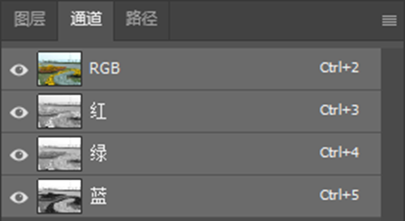
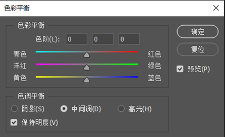
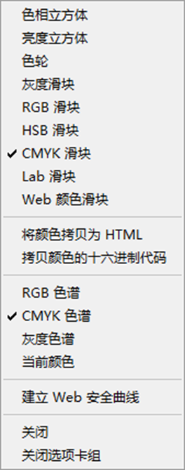
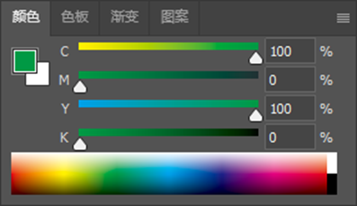
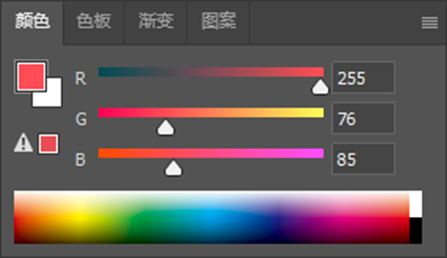

# PS学习记录（一）：颜色
## 一、三原色（RGB）
1. **基本原理**：RGB是发光色彩模式，广泛应用于屏幕等显示设备。白色的RGB值为`(255, 255, 255)` 。颜色之间存在补色关系，蓝色的补色是黄色，绿色补色是洋红，红色补色是青色，计算方式为白色`(255, 255, 255)`减去对应颜色。
2. **颜色数值对应关系**：对于R、G、B单一颜色通道，数值0代表该颜色不发光，255代表最高亮度。
**思考-1**现在来做一个思考题。我们已经知道对于单独的 R、G 或 B 而言，当数值为 0 的时候代表这个颜色不发光；如果为 255，则该颜色为最高亮度。这就好像调光台灯一样，数字 0 就等于把灯关了，数字 255 就等于把调光旋钮开到最大。那么请问：屏幕上的纯黑、纯白、最红色、最绿色、最蓝色、最黄色的 RGB 值各是多少？

## 二、灰度图
1. 灰度图一般为 8 位。这是因为 8 位能表示\(256\)个不同的数值，对应 256 种灰度级别。灰度与 RGB 图中的亮度紧密相关，灰度值 0 ，对应 RGB 的 (0, 0, 0) ，是最暗的状态；灰度值 255 ，对应 RGB 的 (255, 255, 255) ，是最亮的状态。比如在简单的灰度渐变中，灰度值逐渐增加，亮度就从黑到白变化。
2. **通道中的含义**
在通道里，灰度代表饱和度。以 RGB 通道为例，若某区域在红色通道灰度值低，接近 0 ，意味着该区域红色饱和度低，红色成分少；若灰度值高，接近 255 ，则红色饱和度高，红色浓烈。就像一幅图中，若红色通道某处灰度低，那这个地方的红色就暗淡，反之则鲜艳。
3. **蒙版中的含义**：透明度

## 三、通道
1. **通道构成与特性**：RGB图像包含RGB三种通道，每个通道都是一组灰度图，分别反映红绿蓝光的灰度分布。颜色的强度在通道中以灰度表示，越白强度越大（值为255），越黑强度越小（值为0） 。当RGB值均等时，颜色呈现为灰色，此时强度仅影响亮度。`

图 1 通道窗口

2. **操作与调整**：可以通过快捷键Ctrl+B（对应“图像->调整->色彩平衡”）或在“图像->调整->亮度”中对对应通道的亮度进行调整，两种操作方式效果相同。

图 2 色彩平衡窗口

**思考-2**：青色 A，洋红色 B，白 C，绿色 D。注意所有颜色均为纯色。请说出 ABCD 在 RGB 三个通道中的颜色分别是什么？
## 四、CMYK（印刷色彩模式）
1. **模式组成**：CMYK由青色（C）、洋红色（M）、黄色（Y）、黑色（K）组成，是印刷品唯一的色彩模式，依靠外界辅助光源反光被人眼感知。
    

    
图 3 切换至CMYK滑块

    - **色域差异**：RGB色域的颜色数量多于CMYK，且二者存在部分不可相互转换的色彩。因为CMYK中的颜色都为4个滚筒滚出来的颜色，即设计的时候尽可能用少的颜色通道，比如下面的绿色，左边是4通道绿色，右边是2通道绿色
    

    
图 4 CMYK下两种绿色的实现方式

    - **通道灰度差异**：RGB通道灰度图中偏白表示发光程度高，CMYK通道灰度图中偏白表示油墨含量低，反之亦然。
    - **转换差异**：RGB转CMYK会丢失颜色，而CMYK转RGB丢失的颜色较少。
    红色是前景色，白色是背景色，感叹号是该颜色不在CMYK色域内
    

    
图 5 RGB滑块窗口

    - **拾色器**:
    右上角是前景和背景互换，左上角是变为前黑后白
    红色是前景色，白色是背景色，感叹号是该颜色不在CMYK色域内
    

    
图 6 拾色器图标

    这里的感叹号是颜色不在web安全色内（早期网页颜色规范），竖条是色相图，左侧的竖条是灰度图。颜色是在圆圈的圆心中选取的
    

    
图 7 s拾色器窗口

## 五、RGB和CMYK主要区别
-  RGB 色彩模式是发光的，存在于屏幕等显示设备中，不存在于印刷品中。CMYK 色彩模式是反光的，需要外界辅助光源才能被感知，它是印刷品唯一的色彩模式。
-  色彩数量上，RGB 色域的颜色数比 CMYK 多出许多。但两者各有部分色彩是相互独立（即不可转换的）。
-  RGB 通道灰度图中偏白表示发光程度高，CMYK 通道灰度图中偏白却表示油墨含量低，反而言之。

## 六、HSB
HSB模式从三个维度定义颜色，色相表示在色相环上的位置，饱和度代表颜色的鲜艳度，明度等同于亮度。 

## 七、思考答案
1.    
    - 纯黑：`(0, 0, 0)`
    - 纯白：`(255, 255, 255)`
    - 最红色：`(255, 0, 0)`
    - 最绿色：`(0, 255, 0)`
    - 最蓝色：`(0, 0, 255)`
    - 最黄色（黄色由红色和绿色组成）：`(255, 255, 0)`         

      

      
2. 
    - 青色 A：`(0, 255, 255)`
    - 洋红色 B：`(255, 0, 255)`
    - 白色 C：`(255, 255, 255)`
    - 绿色 D：`(0, 255, 0)`
